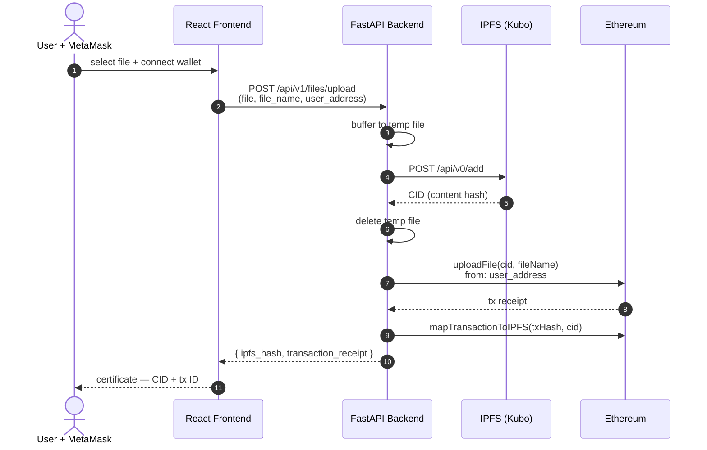
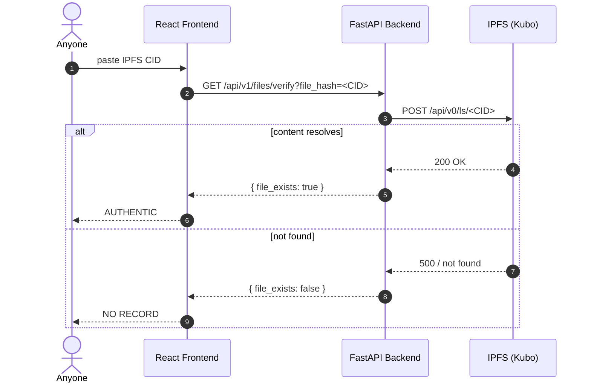
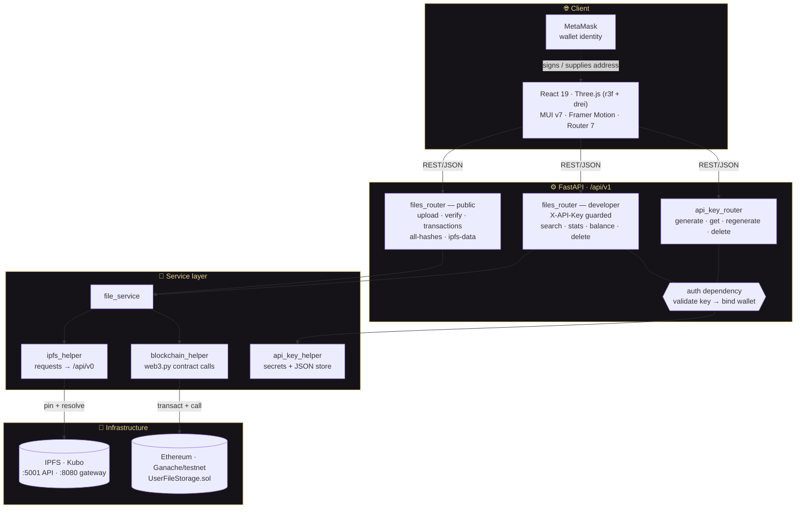

<div align="center">


<br/>


<br/>
<br/>

**A decentralized media integrity platform built on Ethereum + IPFS.**

Stamp any file with a cryptographic fingerprint anchored forever on-chain.<br/>
Verify it. Prove it. Share the proof with anyone — no account required.

<br/>


<br/>

### ▸ Live Demo


</div>

---

## ◆ What Is This?

In a world where reality is manufactured, the only currency worth having is **verifiable truth**.

VeritasChain lets you prove a file — a photo, a document, a video, a dataset — existed at a specific
moment in time, published by a specific wallet, **without trusting any centralized authority**.

> The proof lives on the Ethereum blockchain. It cannot be altered, deleted, or disputed.

**What this is not:** content is pinned to IPFS, which is public and content-addressed. Anyone holding a
CID can fetch the bytes. This is a *provenance and integrity* tool, not a privacy or encryption tool —
stamp things you are willing to publish.

<div align="center">



</div>

---

## ◆ Workflows

### Stamping a file

The CID *is* the fingerprint. IPFS content-addressing hashes the bytes, so an identical file always
yields an identical CID — and any single-bit change yields a completely different one. That CID is
what gets anchored on-chain.



On-chain the contract records `fileHash`, `fileName`, `msg.sender` and `block.timestamp`. That tuple
is the proof: **this wallet published these exact bytes no later than this block.**

### Verifying a file

Verification needs no wallet, no API key, and no account:



> **Note on scope.** `/files/verify` checks IPFS resolution. The blockchain record — wallet, timestamp,
> transaction — is read separately via `/files/transactions` and `/files/all-hashes`, or on-chain through
> `verifyFile(fileHash)` and `getFileMetadata(...)`. A full-provenance check reads both.

### Developer API key lifecycle

```mermaid
flowchart LR
    A[Wallet address] -->|POST /api-keys/generate| B[cg-XXXX-timestamp]
    B --> C[(api_keys.json)]
    C -->|X-API-Key header| D{validate}
    D -->|key unknown| E[401 Invalid API key]
    D -->|key maps to wallet| G{user_address given?}
    G -->|no| H[Authorized]
    G -->|mismatch| I[403 Wallet mismatch]
    G -->|match| H
    H --> J[/files/developer/*]
```

Keys are generated with `secrets.choice` over a 16-character alphabet and bound to the wallet that
requested them, so a key can only ever act for its own address.

---

## ◆ Features

<table>
<tr>
<td width="50%" valign="top">

### ⬢ Stamp
Upload any file. Its IPFS content hash is anchored on-chain via smart contract, tied to your wallet.

</td>
<td width="50%" valign="top">

### ⬢ Verify
Paste an IPFS hash. Instantly know whether it has a blockchain record — **no account required**.

</td>
</tr>
<tr>
<td width="50%" valign="top">

### ⬢ Chain of Custody
Every record carries wallet address, timestamp, and transaction ID — an immutable audit trail.

</td>
<td width="50%" valign="top">

### ⬢ Developer API
Generate an API key with your MetaMask wallet. Stamp files from any pipeline or CI job.

</td>
</tr>
<tr>
<td width="50%" valign="top">

### ⬢ No Accounts
No sign-ups. No email. No passwords. Your wallet **is** your identity.

</td>
<td width="50%" valign="top">

### ⬢ No File Database
Content lives in IPFS, addressed by hash. No server-side file table, no owner who can quietly rewrite it.

</td>
</tr>
</table>

---

## ◆ Architecture

Four tiers. The browser never talks to IPFS or Ethereum directly — every call goes through FastAPI,
which owns both the pinning client and the web3 provider.



### Layer responsibilities

| Layer | Owns | Key modules |
|-------|------|-------------|
| **Client** | Wallet connection, file selection, 3D/motion UI, 10 routes | [`App.js`](frontend/src/App.js), `Components/`, `Micro-Components/` |
| **Routing** | HTTP surface, validation, auth dependencies | [`api/endpoints/`](backend/app/api/endpoints), [`api/dependencies/auth.py`](backend/app/api/dependencies/auth.py) |
| **Services** | Orchestration — pin, then anchor, then map | [`services/`](backend/app/services), [`utils/`](backend/app/utils) |
| **Infrastructure** | Content persistence and consensus | Kubo, Ganache/testnet, `UserFileStorage.sol` |

### Smart contract — [`UserFileStorage.sol`](contracts/contracts/UserFileStorage.sol)

State is keyed by `msg.sender`, so every write and every per-user read is naturally scoped to the
calling wallet — one address can never reach another's records at the contract level.

| Function | Kind | Purpose |
|----------|:----:|---------|
| `uploadFile(fileHash, fileName)` | write | Append a record under `msg.sender` with `block.timestamp` |
| `mapTransactionToIPFS(txHash, fileHash)` | write | Link a transaction to its CID; reverts if already mapped |
| `deleteFile(fileHash)` | write | Remove a record owned by the caller, compacting the array |
| `updateFileMetadata(...)` | write | Amend the caller's stored metadata |
| `verifyFile(fileHash)` | view | Does this hash have a record? |
| `getAllFileHashes()` | view | Hashes, names and timestamps for `msg.sender` |
| `getUserFile(...)` / `getUserFileCount()` | view | Indexed access to the caller's records |
| `getFileMetadata(...)` | view | Stored metadata for a hash |
| `getFileHashByTransaction(txId)` | view | Resolve a transaction back to its CID |
| `getTransactionDetails(txHash)` | view | Full on-chain record for a transaction |
| `searchFiles(query)` | view | Substring match across the caller's file names |

---

## ◆ API Reference

Base URL: `http://localhost:8000/api/v1` · Interactive docs: `http://localhost:8000/docs`

### Public

| Method | Endpoint | Params |
|--------|----------|--------|
| `POST` | `/files/upload` | multipart: `file`, `file_name`, `user_address` |
| `GET` | `/files/verify` | `file_hash` |
| `GET` | `/files/transactions` | `user_address` |
| `GET` | `/files/all-hashes` | `user_address` |
| `GET` | `/files/ipfs-data` | `file_hash` |
| `GET` | `/files/hash-by-transaction` | `transaction_id` |

### API keys

| Method | Endpoint |
|--------|----------|
| `POST` | `/api-keys/generate?user_address=0x…` |
| `GET` | `/api-keys/get/{user_address}` |
| `POST` | `/api-keys/regenerate?user_address=0x…` |
| `DELETE` | `/api-keys/delete/{user_address}` |

### Developer — requires `X-API-Key` header

| Method | Endpoint | Params |
|--------|----------|--------|
| `POST` | `/files/developer/upload` | multipart: `file`, `file_name`, `user_address` |
| `GET` | `/files/developer/transactions` | `user_address` |
| `GET` | `/files/developer/files-with-urls` | `user_address` |
| `GET` | `/files/developer/transaction-details` | `tx_hash` |
| `GET` | `/files/developer/blockchain-stats` | — (block height, gas price) |
| `GET` | `/files/developer/balance` | `user_address` |
| `GET` | `/files/developer/search` | `query` |
| `GET` | `/files/developer/recent-transactions` | `limit` (default 10) |
| `PUT` | `/files/developer/update-metadata` | `file_hash` + JSON body |
| `DELETE` | `/files/developer/delete` | `file_hash` |

<details>
<summary><b>Stamp a file from the command line</b></summary>

```bash
# 1 — mint an API key for your wallet
curl -X POST "http://localhost:8000/api/v1/api-keys/generate?user_address=0xYourWallet"

# 2 — stamp a file
curl -X POST "http://localhost:8000/api/v1/files/developer/upload?user_address=0xYourWallet" \
  -H "X-API-Key: <your-key>" \
  -F "file=@evidence.png" \
  -F "file_name=evidence.png" \
  -F "user_address=0xYourWallet"

# 3 — verify it (public, no key needed)
curl "http://localhost:8000/api/v1/files/verify?file_hash=<ipfs-cid>"
```

</details>

---

## ◆ Quick Start

### Docker — one command

```bash
./start_all.sh          # macOS / Linux
.\start_all.ps1         # Windows PowerShell
```

Brings up Ganache + IPFS, migrates the contract, then boots backend and frontend.

| Service | URL |
|---------|-----|
| Frontend | http://localhost:3000 |
| Backend API | http://localhost:8000 |
| Swagger docs | http://localhost:8000/docs |
| IPFS WebUI | http://localhost:5001/webui |
| Ganache RPC | http://localhost:7545 |

### Manual setup

<details>
<summary><b>1 — Smart contracts</b></summary>

```bash
cd contracts
npm install
npx truffle migrate --network development
# Note the deployed contract address for the backend env
```

</details>

<details>
<summary><b>2 — Backend</b></summary>

```bash
cd backend
python -m venv venv
source venv/bin/activate        # Windows: venv\Scripts\activate
pip install -r requirements.txt
cp .env.example .env
uvicorn app.main:app --reload   # http://localhost:8000
```

</details>

<details>
<summary><b>3 — Frontend</b></summary>

```bash
cd frontend
npm install
cp .env.example .env
npm start                       # http://localhost:3000
```

</details>

**Prerequisites:** Node.js 18+ · Python 3.10+ · MetaMask · Docker (or Ganache locally)

Full walkthrough in [SETUP.md](SETUP.md).

---

## ◆ Environment

**`backend/.env`**
```env
WEB3_PROVIDER_URI=http://127.0.0.1:7545
IPFS_API_URL=http://127.0.0.1:5001
IPFS_GATEWAY_URL=http://127.0.0.1:8080/ipfs
CONTRACT_ABI_PATH=../contracts/build/contracts/UserFileStorage.json
```

**`frontend/.env`**
```env
REACT_APP_API_URL=http://localhost:8000
REACT_APP_API_BASE_URL=http://localhost:8000
REACT_APP_IPFS_BASE_URL=https://ipfs.io/ipfs/
```

> ⚠️ `CORS_ORIGINS` defaults to `["*"]` in [backend/app/core/config.py](backend/app/core/config.py#L27) —
> restrict it to your real origins before any public deployment.

---

## ◆ Project Structure

```
VeritasChain/
├── frontend/                       # React 19 + Three.js
│   └── src/
│       ├── Components/             # LandingPage · BlockchainFileUploader · VerifyPage
│       │                           # HowItWorksPage · DocsPage · AboutPage · APIKeyPage
│       │                           # TransactionList
│       └── Micro-Components/       # Navbar · Footer · HeroSection · ParticleNetwork
│                                   # FeatureCard · StatsSection · Logo
├── backend/                        # FastAPI
│   └── app/
│       ├── main.py                 # app factory, CORS, /api/v1 router mount
│       ├── api/endpoints/          # file_router · api_key_router
│       ├── api/dependencies/       # auth — X-API-Key + wallet binding
│       ├── services/               # IPFS pinning · chain writes · key lifecycle
│       ├── core/config.py          # pydantic settings
│       └── utils/                  # blockchain_helper · logger
├── contracts/                      # Truffle + OpenZeppelin
│   └── contracts/UserFileStorage.sol
├── infrastructure-compose.yml      # Ganache + IPFS
└── application-compose.yml         # backend + frontend
```

---

## ◆ Philosophy

VeritasChain was built anonymously.

No names. No faces. No VC funding. No agenda. Just tools that work.

> *"In a world where reality is manufactured, the only currency worth having is verifiable truth."*

The belief is simple: **knowledge should be free, and the tools to verify it should be available to all.**

*Judge the code, not the coder.*

---

## ◆ License

MIT — do whatever you want with it.

<div align="center">
<br/>

**⬢ ⬢ ⬢**

<sub>Hash it. Anchor it. Prove it.</sub>

</div>
