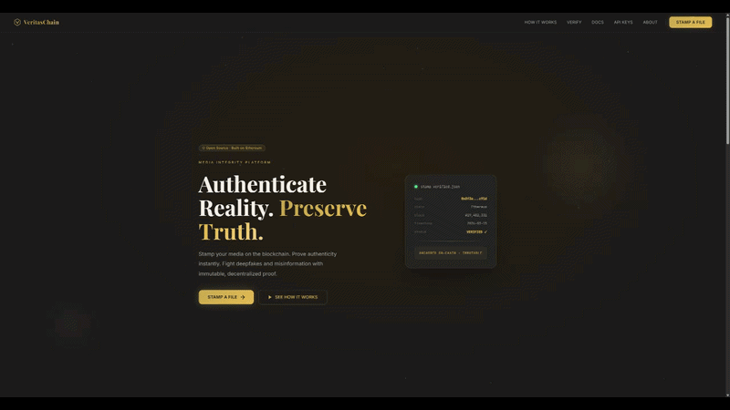
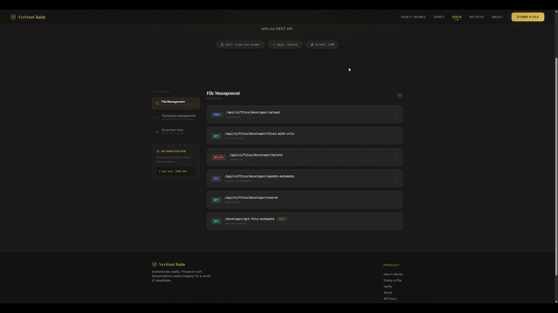
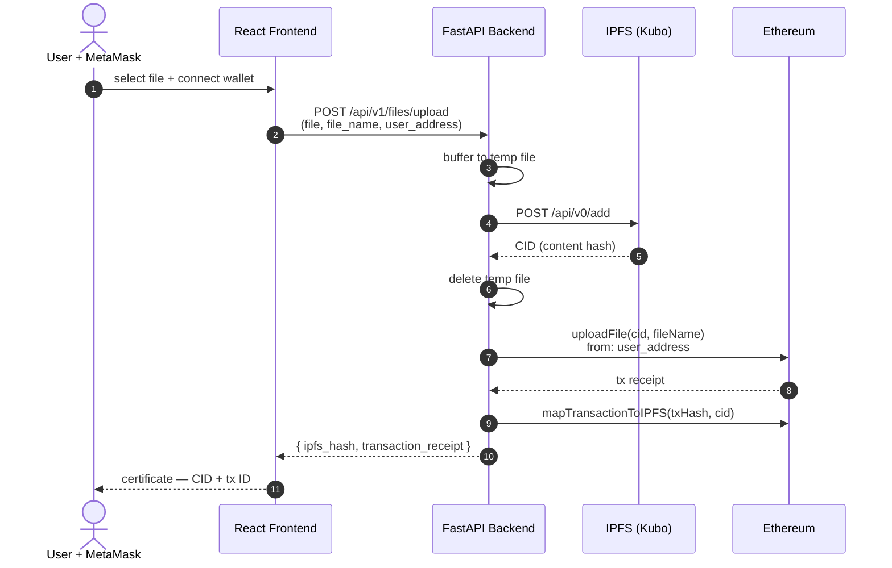
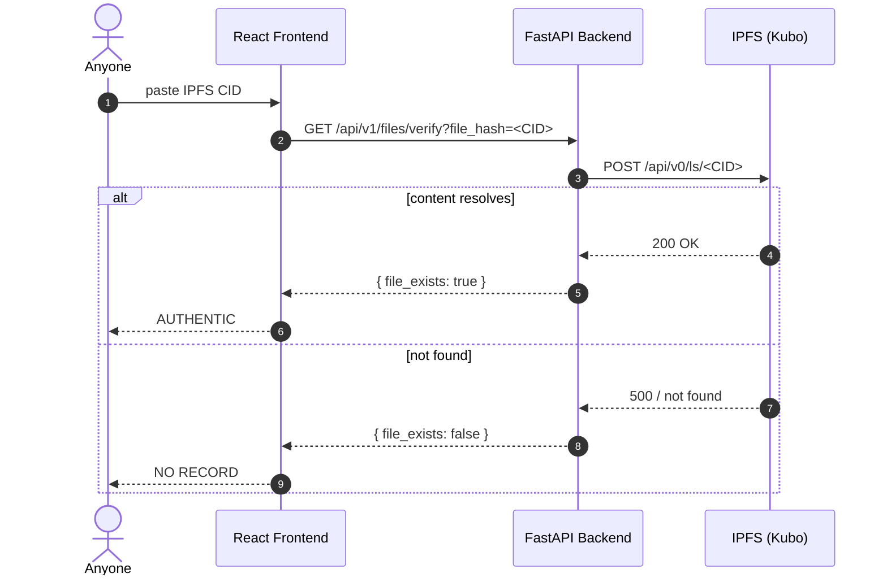
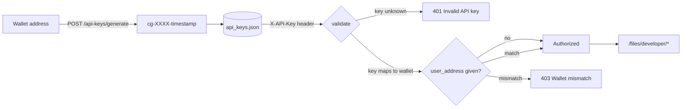
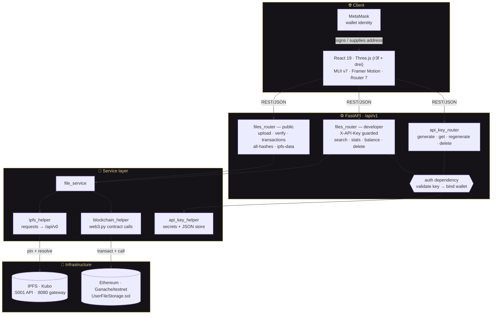

<div align="center">

<picture>
  <source media="(prefers-color-scheme: dark)" srcset="docs/assets/banner-dark.svg">
  <source media="(prefers-color-scheme: light)" srcset="docs/assets/banner-light.svg">
  
</picture>

<br>

### Prove a file existed, at a given moment, published by a given wallet — with nothing to trust but a public blockchain.

[](LICENSE)
[](backend/requirements.txt)
[](frontend/package.json)
[](contracts/contracts/UserFileStorage.sol)
[](#status-and-limitations)

[What it solves](#what-it-solves) ·
[Quick start](#quick-start) ·
[See it work](#see-it-work) ·
[How it works](#workflows) ·
[Architecture](#architecture) ·
[API](#api-reference) ·
[Status](#status-and-limitations)

<br>

<picture>
  <source media="(prefers-color-scheme: dark)" srcset="docs/assets/flow-dark.svg">
  <source media="(prefers-color-scheme: light)" srcset="docs/assets/flow-light.svg">
  
</picture>

</div>

<br>

## What it solves

A screenshot proves nothing. A file's metadata can be rewritten, its timestamp forged, its origin
disputed. The usual answer is to trust somebody — a platform, a notary, a CDN — to vouch that the
bytes are what they claim to be and arrived when they claim to have arrived.

VeritasChain removes the somebody.

You publish a file, its content hash is anchored on Ethereum alongside your wallet address and a block
timestamp, and from then on anyone can check that record without asking permission, creating an
account, or trusting this project's servers to still exist.

> **The proof outlives the platform.** Even if every server here goes dark, the chain record stands —
> readable by any Ethereum client, forever.

**What it is not.** Content is pinned to IPFS, which is public and content-addressed: anyone holding a
CID can fetch the bytes. This is a *provenance and integrity* tool, not a privacy or encryption tool.
Stamp things you are willing to publish.

<br>

## See it work

<details open>
<summary><b>1 · Stamp a file — it becomes a permanent record</b></summary>

Connect MetaMask, drop a file. The backend pins it to IPFS, takes the resulting CID, and writes it
on-chain against your address:

```text
POST /api/v1/files/upload    evidence.png · 0xA3f…91c

  ✦ pinned to IPFS         QmX4f…8ab
  ✦ anchored on Ethereum   uploadFile(QmX4f…8ab, "evidence.png")
  ✦ mapped transaction     0x7d2e…44f1

  ✓ certificate — CID QmX4f…8ab · tx 0x7d2e…44f1
```

That tuple — hash, wallet, `block.timestamp` — is the whole claim: *this address published these exact
bytes no later than this block.* Change one pixel and the CID changes completely, so the old record no
longer matches the new file.


</details>

<details>
<summary><b>2 · Verify without an account, a wallet, or a key</b></summary>

Verification is a read. No sign-up, no connection, no API key:

```text
GET /api/v1/files/verify?file_hash=QmX4f…8ab

  ✓ AUTHENTIC     content resolves on IPFS
```

The chain side — who published it and when — is read separately through `/files/transactions` and
`/files/all-hashes`, or straight from the contract via `verifyFile()` and `getFileMetadata()`. A full
provenance check reads both. See the [note on scope](#verifying-a-file).


</details>

<details>
<summary><b>3 · Stamp from a pipeline, not a browser</b></summary>

Mint a key against your wallet, then stamp from CI, a cron job, or a camera rig:

```bash
curl -X POST "http://localhost:8000/api/v1/api-keys/generate?user_address=0xYourWallet"

curl -X POST "http://localhost:8000/api/v1/files/developer/upload?user_address=0xYourWallet" \
  -H "X-API-Key: cg-XXXXXXXXXXXXXXXX-20260315183728" \
  -F "file=@evidence.png" -F "file_name=evidence.png" -F "user_address=0xYourWallet"
```

Keys are bound to the wallet that requested them — a key presented with a different `user_address`
is rejected with `403`. The developer tier also exposes search, chain stats, balances and metadata
updates; see the [API reference](#api-reference).
</details>

<details>
<summary><b>4 · Your wallet is the only account</b></summary>

There is no user table. No email, no password, no session to steal. Identity is the address that signed
its way onto the chain, and authorization is whatever that address already owns.

Contract state is keyed by `msg.sender`, so per-user reads are scoped at the contract level — one
address structurally cannot enumerate another's records.
</details>

<br>

---

## Workflows

### Stamping a file

The CID *is* the fingerprint. IPFS content-addressing hashes the bytes, so an identical file always
yields an identical CID — and any single-bit change yields a completely different one. That CID is
what gets anchored on-chain.



On-chain the contract records `fileHash`, `fileName`, `msg.sender` and `block.timestamp`. That tuple
is the proof: **this wallet published these exact bytes no later than this block.**

### Verifying a file

Verification needs no wallet, no API key, and no account:



> **Note on scope.** `/files/verify` checks IPFS resolution. The blockchain record — wallet, timestamp,
> transaction — is read separately via `/files/transactions` and `/files/all-hashes`, or on-chain through
> `verifyFile(fileHash)` and `getFileMetadata(...)`. A full-provenance check reads both.

### Developer API key lifecycle



Keys are generated with `secrets.choice` over a 16-character alphabet and bound to the wallet that
requested them, so a key can only ever act for its own address.

---

## Why this approach

Most "content authenticity" tooling asks you to trust an issuer: a platform badge, a signing service,
a vendor's certificate chain. That works right up until the issuer disappears, gets acquired, or
decides your file is no longer convenient.

| | VeritasChain | Platform badges<br/>(C2PA services, verified marks) | Notary / timestamp SaaS |
|---|:-:|:-:|:-:|
| Proof survives the vendor shutting down | ✅ on-chain | ❌ | ❌ |
| Verify without an account | ✅ | partial | ❌ |
| Publisher identity is cryptographic, not administrative | ✅ wallet | ❌ | ❌ |
| Anyone can audit the full record independently | ✅ | ❌ | partial |
| Tamper-evident by construction | ✅ content-addressed | ✅ | ✅ |
| No per-verification fee or rate limit | ✅ | ❌ | ❌ |
| Works without the original file present | ✅ CID only | ❌ | ✅ |

The tradeoff is real and worth stating plainly: anchoring costs gas, and pinned content is public.
You are buying permanence and independence, and paying for it in transaction fees and disclosure.

---

## Architecture

Four tiers. The browser never talks to IPFS or Ethereum directly — every call goes through FastAPI,
which owns both the pinning client and the web3 provider.



### Layer responsibilities

| Layer | Owns | Key modules |
|-------|------|-------------|
| **Client** | Wallet connection, file selection, 3D/motion UI, 10 routes | [`App.js`](frontend/src/App.js), `Components/`, `Micro-Components/` |
| **Routing** | HTTP surface, validation, auth dependencies | [`api/endpoints/`](backend/app/api/endpoints), [`api/dependencies/auth.py`](backend/app/api/dependencies/auth.py) |
| **Services** | Orchestration — pin, then anchor, then map | [`services/`](backend/app/services), [`utils/`](backend/app/utils) |
| **Infrastructure** | Content persistence and consensus | Kubo, Ganache/testnet, `UserFileStorage.sol` |

### Smart contract — [`UserFileStorage.sol`](contracts/contracts/UserFileStorage.sol)

State is keyed by `msg.sender`, so every write and every per-user read is naturally scoped to the
calling wallet — one address can never reach another's records at the contract level.

| Function | Kind | Purpose |
|----------|:----:|---------|
| `uploadFile(fileHash, fileName)` | write | Append a record under `msg.sender` with `block.timestamp` |
| `mapTransactionToIPFS(txHash, fileHash)` | write | Link a transaction to its CID; reverts if already mapped |
| `deleteFile(fileHash)` | write | Remove a record owned by the caller, compacting the array |
| `updateFileMetadata(...)` | write | Amend the caller's stored metadata |
| `verifyFile(fileHash)` | view | Does this hash have a record? |
| `getAllFileHashes()` | view | Hashes, names and timestamps for `msg.sender` |
| `getUserFile(...)` / `getUserFileCount()` | view | Indexed access to the caller's records |
| `getFileMetadata(...)` | view | Stored metadata for a hash |
| `getFileHashByTransaction(txId)` | view | Resolve a transaction back to its CID |
| `getTransactionDetails(txHash)` | view | Full on-chain record for a transaction |
| `searchFiles(query)` | view | Substring match across the caller's file names |

---

## API Reference

Base URL: `http://localhost:8000/api/v1` · Interactive docs: `http://localhost:8000/docs`

### Public

| Method | Endpoint | Params |
|--------|----------|--------|
| `POST` | `/files/upload` | multipart: `file`, `file_name`, `user_address` |
| `GET` | `/files/verify` | `file_hash` |
| `GET` | `/files/transactions` | `user_address` |
| `GET` | `/files/all-hashes` | `user_address` |
| `GET` | `/files/ipfs-data` | `file_hash` |
| `GET` | `/files/hash-by-transaction` | `transaction_id` |

### API keys

| Method | Endpoint |
|--------|----------|
| `POST` | `/api-keys/generate?user_address=0x…` |
| `GET` | `/api-keys/get/{user_address}` |
| `POST` | `/api-keys/regenerate?user_address=0x…` |
| `DELETE` | `/api-keys/delete/{user_address}` |

### Developer — requires `X-API-Key` header

| Method | Endpoint | Params |
|--------|----------|--------|
| `POST` | `/files/developer/upload` | multipart: `file`, `file_name`, `user_address` |
| `GET` | `/files/developer/transactions` | `user_address` |
| `GET` | `/files/developer/files-with-urls` | `user_address` |
| `GET` | `/files/developer/transaction-details` | `tx_hash` |
| `GET` | `/files/developer/blockchain-stats` | — (block height, gas price) |
| `GET` | `/files/developer/balance` | `user_address` |
| `GET` | `/files/developer/search` | `query` |
| `GET` | `/files/developer/recent-transactions` | `limit` (default 10) |
| `PUT` | `/files/developer/update-metadata` | `file_hash` + JSON body |
| `DELETE` | `/files/developer/delete` | `file_hash` |

<details>
<summary><b>Stamp a file from the command line</b></summary>

```bash
# 1 — mint an API key for your wallet
curl -X POST "http://localhost:8000/api/v1/api-keys/generate?user_address=0xYourWallet"

# 2 — stamp a file
curl -X POST "http://localhost:8000/api/v1/files/developer/upload?user_address=0xYourWallet" \
  -H "X-API-Key: <your-key>" \
  -F "file=@evidence.png" \
  -F "file_name=evidence.png" \
  -F "user_address=0xYourWallet"

# 3 — verify it (public, no key needed)
curl "http://localhost:8000/api/v1/files/verify?file_hash=<ipfs-cid>"
```

</details>

---

## Quick Start

### Docker — one command

```bash
./start_all.sh          # macOS / Linux
.\start_all.ps1         # Windows PowerShell
```

Brings up Ganache + IPFS, migrates the contract, then boots backend and frontend.

| Service | URL |
|---------|-----|
| Frontend | http://localhost:3000 |
| Backend API | http://localhost:8000 |
| Swagger docs | http://localhost:8000/docs |
| IPFS WebUI | http://localhost:5001/webui |
| Ganache RPC | http://localhost:7545 |

### Manual setup

<details>
<summary><b>1 — Smart contracts</b></summary>

```bash
cd contracts
npm install
npx truffle migrate --network development
# Note the deployed contract address for the backend env
```

</details>

<details>
<summary><b>2 — Backend</b></summary>

```bash
cd backend
python -m venv venv
source venv/bin/activate        # Windows: venv\Scripts\activate
pip install -r requirements.txt
cp .env.example .env
uvicorn app.main:app --reload   # http://localhost:8000
```

</details>

<details>
<summary><b>3 — Frontend</b></summary>

```bash
cd frontend
npm install
cp .env.example .env
npm start                       # http://localhost:3000
```

</details>

**Prerequisites:** Node.js 18+ · Python 3.10+ · MetaMask · Docker (or Ganache locally)

Full walkthrough in [SETUP.md](SETUP.md).

---

## Environment

**`backend/.env`**
```env
WEB3_PROVIDER_URI=http://127.0.0.1:7545
IPFS_API_URL=http://127.0.0.1:5001
IPFS_GATEWAY_URL=http://127.0.0.1:8080/ipfs
CONTRACT_ABI_PATH=../contracts/build/contracts/UserFileStorage.json
```

**`frontend/.env`**
```env
REACT_APP_API_URL=http://localhost:8000
REACT_APP_API_BASE_URL=http://localhost:8000
REACT_APP_IPFS_BASE_URL=https://ipfs.io/ipfs/
```

> ⚠️ `CORS_ORIGINS` defaults to `["*"]` in [backend/app/core/config.py](backend/app/core/config.py#L27) —
> restrict it to your real origins before any public deployment.

---

## Project Structure

```
VeritasChain/
├── frontend/                       # React 19 + Three.js
│   └── src/
│       ├── Components/             # LandingPage · BlockchainFileUploader · VerifyPage
│       │                           # HowItWorksPage · DocsPage · AboutPage · APIKeyPage
│       │                           # TransactionList
│       └── Micro-Components/       # Navbar · Footer · HeroSection · ParticleNetwork
│                                   # FeatureCard · StatsSection · Logo
├── backend/                        # FastAPI
│   └── app/
│       ├── main.py                 # app factory, CORS, /api/v1 router mount
│       ├── api/endpoints/          # file_router · api_key_router
│       ├── api/dependencies/       # auth — X-API-Key + wallet binding
│       ├── services/               # IPFS pinning · chain writes · key lifecycle
│       ├── core/config.py          # pydantic settings
│       └── utils/                  # blockchain_helper · logger
├── contracts/                      # Truffle + OpenZeppelin
│   └── contracts/UserFileStorage.sol
├── infrastructure-compose.yml      # Ganache + IPFS
└── application-compose.yml         # backend + frontend
```

---

## Status and limitations

**Alpha.** The stamp-and-verify loop works end to end against a local Ganache chain, and the contract's
per-wallet scoping is sound. The trust boundary around it is not finished. Read this before pointing it
at anything real.

| | Area | State |
|---|---|---|
| ✅ | Contract storage & scoping | State keyed by `msg.sender`; one address cannot reach another's records |
| ✅ | IPFS pinning and resolution | Kubo `/api/v0/add` and `/ls`, content-addressed end to end |
| ✅ | Local dev stack | One-command Docker bring-up: Ganache + IPFS + backend + frontend |
| ⚠️ | **Wallet ownership is unverified** | `user_address` is an unauthenticated request field — see below |
| ⚠️ | **API key issuance is unauthenticated** | `POST /api-keys/generate` mints a key for any address |
| ⚠️ | Transaction signing | Uses `.transact({"from": …})`, which needs node-held keys — Ganache only |
| ⏳ | Testnet / mainnet | Blocked on client-side signing |
| ⏳ | Key storage | Flat JSON file; no rotation policy or hashing at rest |

### The open security gaps

Two are worth spelling out, because they undercut the guarantee on the public endpoints:

**Anyone can stamp a file as anyone else.** `POST /files/upload` accepts `user_address` as a plain form
field and passes it straight to the contract call. There is no signature and no proof the caller controls
that wallet, so a forged record can attribute any file to any address.

**API keys can be minted for any wallet.** `POST /api-keys/generate?user_address=0xVictim` issues a
working key with no ownership check, and `GET /api-keys/get/{address}` returns an existing key in
plaintext. The `verify_api_key_and_wallet` dependency behind them is written correctly — it binds key to
wallet and returns `403` on mismatch — but it is bypassed by the unauthenticated minting endpoint in
front of it.

Both have the same fix: have the client sign a nonce with MetaMask, recover the signer with
`w3.eth.account.recover_message`, and trust the recovered address instead of the supplied string. That
also replaces `.transact()` with a signed transaction, which is what unblocks real networks.

Until that lands, treat this as a local demonstration of the architecture rather than a service to
stamp anything you would need to defend.

---

## Philosophy

VeritasChain was built anonymously.

No names. No faces. No VC funding. No agenda. Just tools that work.

> *"In a world where reality is manufactured, the only currency worth having is verifiable truth."*

The belief is simple: **knowledge should be free, and the tools to verify it should be available to all.**

*Judge the code, not the coder.*

---

## License

MIT — do whatever you want with it.

<div align="center">
<br/>

**⬢ ⬢ ⬢**

<sub>Hash it. Anchor it. Prove it.</sub>

</div>
